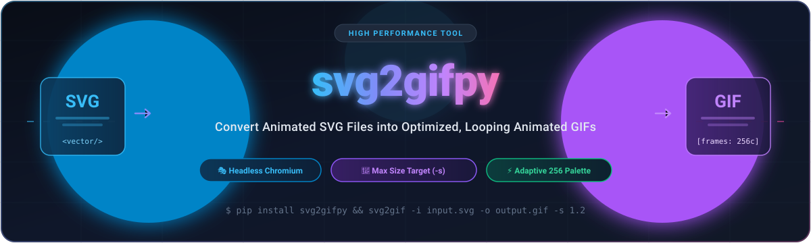
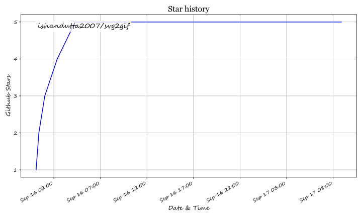

<p align="center">
  
</p>

# svg2gifpy (svg2gif) 🎨➡️🎬

A high-performance CLI tool & Python library for converting animated SVG files into optimized, looping animated GIFs using headless Playwright and Pillow.

> **PyPI Package**: [`svg2gifpy`](https://pypi.org/project/svg2gifpy/) (provides both `svg2gif` and `svg2gifpy` CLI and Python module imports)

---

## ✨ Features

- **Headless Browser Rendering**: Accurate rendering of CSS animations, SMIL, and JavaScript-driven SVG animations using Playwright (Chromium).
- **Aspect Ratio Preservation**: Automatically detects SVG viewBox/dimensions to maintain precise aspect ratios during frame capture.
- **Smart Optimization Engine**:
  - **Downscaling**: Automatically resizes large SVGs to ideal max-width parameters for smaller file outputs.
  - **Palette Quantization**: Applies 256-color adaptive palette conversion per frame.
  - **Frame Compression**: Leverages Pillow's optimization to discard redundant frame data.
- **Max File Size Targeting (`-s`)**: Automatically chooses the ideal balanced (FPS, duration) pair to maximize quality within a target file size.
- **CLI & Module Support**: Installable via `pip install svg2gifpy` and runnable directly from the command line (`svg2gif` or `svg2gifpy`).

---

## 👥 Guides by Audience

- [1. 📖 For Users](#-for-users)
- [2. 💻 For Developers & Contributors](#-for-developers--contributors)
- [3. 🚀 For Package Publishers & DevOps](#-for-package-publishers--devops)

---

## 📖 For Users

### 1. Installation

Install `svg2gifpy` from PyPI and ensure the Playwright Chromium browser binary is installed:

```bash
pip install svg2gifpy
playwright install chromium
```

### 2. Command Line Interface (CLI)

Use the CLI binary (`svg2gif` or `svg2gifpy`) to convert SVG files from your terminal:

```bash
# Basic conversion (svg2gif and svg2gifpy commands are both available)
svg2gif -i path/to/input.svg -o path/to/output.gif
```

#### CLI Reference

```text
usage: svg2gif [-h] [-i INPUT] [-o OUTPUT] [-d DURATION] [-f FPS]
               [-w MAX_WIDTH] [-s MAX_FILE_SIZE]

Convert animated SVG files into optimized looping animated GIFs.

options:
  -h, --help            show this help message and exit
  -i, --input INPUT     Path to input .svg file (default: assets/banner.svg)
  -o, --output OUTPUT   Path to output .gif file (default: assets/social-preview.gif)
  -d, --duration DURATION
                        Duration of the animation capture loop in seconds (default: 3.0).
                        Ignored if -s / --max-file-size is specified.
  -f, --fps FPS         Frames per second (default: 30).
                        Ignored if -s / --max-file-size is specified.
  -w, --max-width MAX_WIDTH
                        Maximum width for output GIF downscaling (default: 640)
  -s, --max-file-size MAX_FILE_SIZE, --max-size MAX_FILE_SIZE
                        Maximum output GIF file size in MB (e.g. 1.2 or 1.2MB, 800KB).
                        When set, overrides and ignores --fps and --duration to automatically
                        calculate the optimal balanced (fps, duration) pair within this limit.
```

#### CLI Examples

- **Custom loop duration and frame rate:**
  ```bash
  svg2gif -i banner.svg -o banner.gif -d 4.0 -f 20 -w 800
  ```

- **Constrain to maximum file size (auto-calculates optimal FPS and duration):**
  ```bash
  # Max 1.2 MB output (automatically finds highest permissible frames with balanced FPS and loop duration)
  svg2gif -i banner.svg -o banner.gif -s 1.2

  # Using KB units
  svg2gif -i banner.svg -o banner.gif -s 800KB
  ```

### 3. Python API

Import `svg2gif` (or `svg2gifpy`) into your Python applications:

```python
from svg2gif import convert_animated_svg_to_gif
# Alternatively: from svg2gifpy import convert_animated_svg_to_gif

# Basic conversion with explicit duration and FPS
convert_animated_svg_to_gif(
    svg_path="banner.svg",
    output_gif_path="banner.gif",
    duration_seconds=3.0,  # Duration in seconds
    fps=30,                # Frames per second
    max_width=640          # Downscale width if original exceeds 640px
)

# Auto-optimized conversion constrained by maximum file size
convert_animated_svg_to_gif(
    svg_path="banner.svg",
    output_gif_path="banner.gif",
    max_file_size=1.2,     # Target limit in MB (e.g. 1.2 or '800KB')
    max_width=640
)
```

---

## 💻 For Developers & Contributors

### 1. Clone Repository

```bash
git clone https://github.com/ishandutta2007/svg2gif.git
cd svg2gif
```

### 2. Set Up Virtual Environment

#### Standard `venv`:
```bash
python -m venv venv
# On Windows:
venv\Scripts\activate
# On Linux/macOS:
source venv/bin/activate
```

#### Or with `pyenv`:
```bash
pyenv install 3.11.4
pyenv virtualenv 3.11.4 svg2gif-env
pyenv local svg2gif-env
```

### 3. Install in Editable Mode

Install dependencies and link the package locally so edits are immediately reflected:

```bash
pip install -e .
playwright install chromium
```

### 4. Running Tests

Run the test suite locally before creating pull requests:

```bash
python -m unittest test_svg2gif.py
```

CI workflows in [`.github/workflows/ci.yml`](.github/workflows/ci.yml) will automatically run tests across Python 3.9, 3.10, 3.11, and 3.12 on every push and pull request.

---

## 🚀 For Package Publishers & DevOps

### 1. Automated PyPI Publishing on Push

The repository includes a fully automated release pipeline in [`.github/workflows/publish.yml`](.github/workflows/publish.yml).

Whenever you increment the version in [`pyproject.toml`](pyproject.toml) and push to the `main` branch, the workflow:
1. **Reads package name and version**: Automatically parses the `name` (`svg2gifpy`) and `version` fields from `pyproject.toml`.
2. **Checks PyPI**: Checks the official PyPI JSON API to determine if `svg2gifpy==<version>` already exists:
   - If the version **already exists**: It skips publishing safely (idempotent; no duplicate release errors).
   - If the version is **new**: It executes the release pipeline.
3. **Runs tests**: Runs the complete test suite against the target code.
4. **Builds distribution**: Generates source archive (`.tar.gz`) and wheel (`.whl`) via `python -m build`.
5. **Publishes to PyPI**: Uploads distributions to PyPI under [`svg2gifpy`](https://pypi.org/project/svg2gifpy/).
6. **Creates GitHub Release**: Generates a Git tag (`vX.Y.Z`) and GitHub Release with auto-generated release notes and attached distribution artifacts.

### 2. How to Release a New Version

To release a new version to PyPI:

1. Bump the version in [`pyproject.toml`](pyproject.toml):
   ```toml
   [project]
   name = "svg2gifpy"
   version = "0.2.0"  # <-- Increment version here
   ```
2. Commit and push to `main`:
   ```bash
   git add pyproject.toml
   git commit -m "chore: bump version to 0.2.0"
   git push origin main
   ```
3. GitHub Actions handles the rest automatically! Monitor progress under the repository's **Actions** tab.

### 3. PyPI Authentication Setup

The workflow supports both modern PyPI authentication methods:

#### Option A: PyPI Trusted Publishing (OIDC) — *Recommended*
1. Go to your PyPI project settings on [pypi.org](https://pypi.org/manage/project/svg2gifpy/settings/publishing/).
2. Under **Publishing**, add a **Trusted Publisher**:
   - **Owner**: `ishandutta2007`
   - **Repository name**: `svg2gif`
   - **Workflow name**: `publish.yml`
   - **Environment name**: `pypi`
3. No secret tokens required!

#### Option B: PyPI API Token Secret
1. Create an API token on [pypi.org/manage/account/token/](https://pypi.org/manage/account/token/) with upload permissions for `svg2gifpy` (or entire account if first upload).
2. In GitHub, navigate to **Settings** ➡️ **Secrets and variables** ➡️ **Actions**.
3. Create a repository secret named `PYPI_API_TOKEN` and paste your token value (starting with `pypi-`).

### 4. Manual Publishing Fallback

If you ever need to publish manually from your local machine:

```bash
pip install build twine
python -m build
twine upload dist/*
```

---

## 📄 License

This project is licensed under the MIT License - see the [LICENSE](file:///C:/Users/ishan/Documents/Projects/svg2gif/LICENSE) file for details.

---

## ⭐ Star History

<a href="https://star-history.com/#ishandutta2007/svg2gif&Timeline" align="center">
  <picture>
    <source media="(prefers-color-scheme: dark)" srcset="assets/ishandutta2007_svg2gif_growth.svg">
    
  </picture>
</a>
